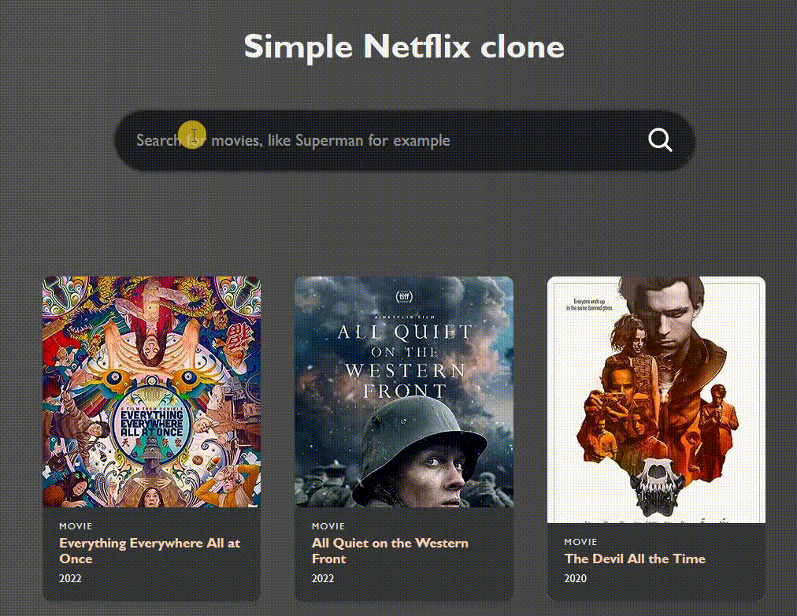

# 🛠 React - simple netflix clone

# 🔗 [Live Preview]()

## Welcome! 👋

- This is a very simple "netflix" clone where i primarily practice fetching data from API and displaying it, thats it. It is not perfect but it was a quick practice project 

---

### Languages and features 👨‍💻 

- React: local state management, components, useEffect, maps 
- Styling: pure css thats not following any conventions or good practices because css was already provided

Thanks for checking out my projects.